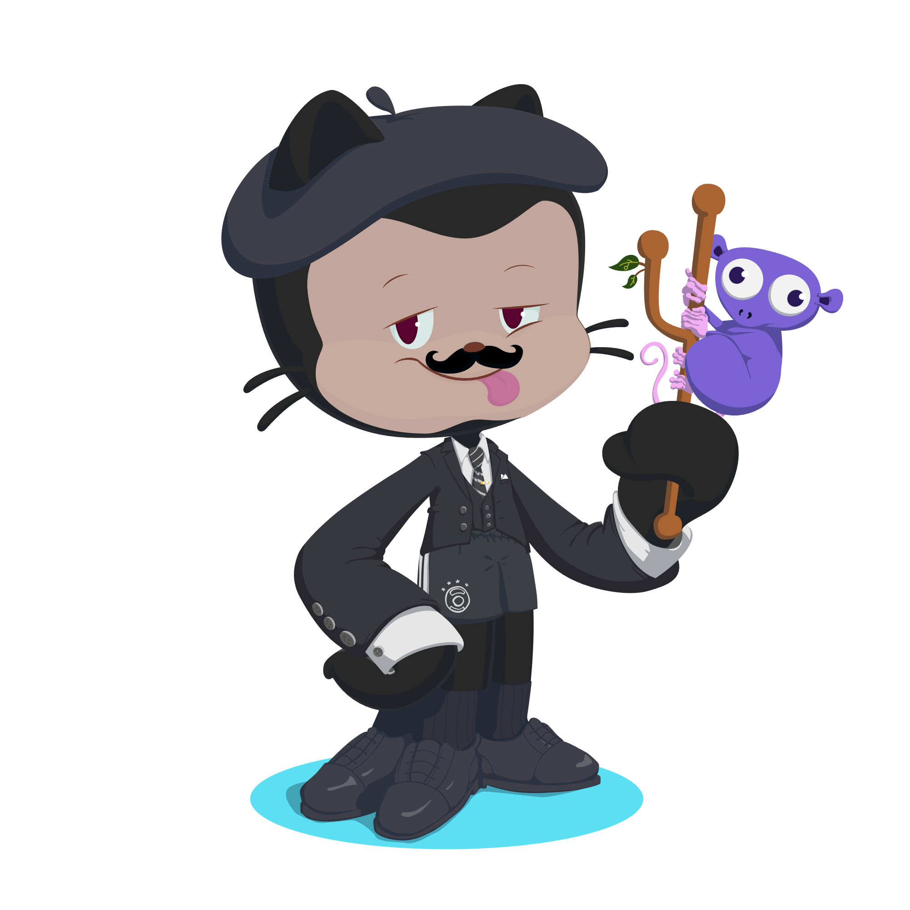

  

## 👋 Olá! Eu sou o Thomas

🎓 Tenho 18 anos e atualmente estou estudando desenvolvimento e aprimorando minhas habilidades como programador.  
🔧 Aqui você vai encontrar meus projetos, testes, estudos e evolução constante no mundo da tecnologia.

---

## 🧠 Tecnologias que estou estudando / utilizando

---

## 😄 Um pouco de humor para aliviar o código

---

## 📬 Como falar comigo?

📧 **Email:** seuemail@exemplo.com  
💬 **Instagram:** [@seuuser](https://instagram.com/seuuser)

---

✨ *Obrigado por visitar meu perfil!*
